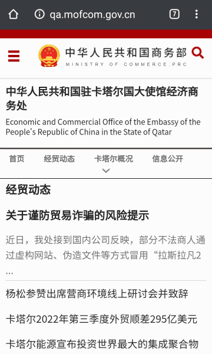

从世界杯看国别表
===============
大萌	202212

　　卡塔尔世界杯正在如火如荼的举行，很多人通过屏幕认识了各国球队和球星。在32支参赛队的背后，某些国家的名字可能会让人感到陌生，比如克罗地亚、摩洛哥(不是摩纳哥)，有什么办法了解呢？一般会用搜索引擎，但是这样搜到的信息比较杂乱，需要读者自己花不少时间筛选；而某些有条理的好网站，又很难被搜到。怎么办呢？

　　这里借微信公众号《行政区》向大家介绍一个迅速查找世界各国概况的网页：老生常谈网站的《[国别代码速查表](https://Laosheng.top/ydyl/nations)》。这个速查表是一个集成了上千个网址的“大规模集成网页”，里面的内容相当密集，可以迅速找到一国的国情、与我国的关系、常用代码与货币等等。由于该网页信息量大，形式新颖，有必要给大家做一个图例说明。

　　我们先看本次世界杯的东道主，在亚洲中部的卡塔尔。

　　卡塔尔的国旗后面标记了‘+’与‘&’号，表明其为联合国会员国和一带一路的签约国；从字号大小上看，其国土面积比巴林大、比沙特小；“卡塔尔”三个字可点击，会打开中国外交部为卡塔尔编写的‘国别概况页’，页面显示最后更新时间是今年9月，数据非常新。

　　右侧红线框内有三个图标，分别是一带一路官网的‘国别美图页’、商务部的‘经贸指南页’、中国驻卡塔尔大使馆的官方网站。我们看第2个，这是中国驻卡塔尔大使馆的经济商务处官方网页，里面有最新的经贸动态，是国别概况页的很好补充。

　　红色虚线框内的这三个图标指向的都是中文网页，因为他们是由中方制作，接下去几个图标的指向网页则未必是中文，它们是由对方制作。当然，对方国家既然与中方建交，自然会考虑网页能够适合中方人士阅读，使用中文也是有可能的。

　　黄色虚线框内的两个图标，指向卡塔尔驻中国大使馆官网和微博。点开链接可以看到官网默认为英文，右上角我用蓝色虚线圈出来的字样是阿拉伯文写的‘阿拉伯文’，这是为读者提供了两种网页语言，因为大使馆要面对双方（甚至多方）读者。也许是中文对于老外太难了，卡塔尔大使馆并没有制作中文网页，不过他们大使馆开通的微博一直在使用中文，最近的微博在介绍世界杯呢。

　　在第一张图片中，我们可以看到卡塔尔首都多哈与北京时间的时差为-5h。世界杯在进入淘汰赛阶段后，比赛一般在当地时间18时和22时，往后推5个小时，也就是北京时间晚上11点和凌晨3点(决赛)。　我们再来看实力最强的欧洲。这次欧洲有5支球队进入八强：英国、法国、荷兰、克罗地亚、葡萄牙。先从我们熟悉的英、法两国说起（他们正要进行四分之一决赛）：

　　图中可以看到，英、法等四个欧洲国家，都没有‘&’符号，表明他们都没有同中国签订一带一路协议，(所以)发改委主管的一带一路官网也就没有给这几个国家制作‘国别美图页’，没有🏔️图标。　图中还能看到英、法两国的国际长途区号分别是 44 和 33（这俩真是一对），如果你的电话开通了国际长途，那么你在中国拨打 0044-192 ，就能接通英国的查号台，想好say what了吗？

　　非洲的摩洛哥

　　大规模集成网页比App或小程序好在哪里？可以利用浏览器实现丰富的功能。比如：

1、 利用浏览器翻译外文网页
-----------------------
再点击政府图标🏛，打开的是阿根廷政府的官网，字母有些怪怪的？那是西班牙语。右上角有个‘mi’小图标，那可不是中国的小米，翻译成英文是 MyAgent，我的阿根廷，是网站用户注册或登录的地方。

　　如果你使用的浏览器是chrome、Edge等，可以直接启动网页的翻译功能，把网页中大部门文字翻译成中文，这个样子：
插图：阿根廷政府网页在手机上翻译情况。

2、 利用浏览器查找或统计
---------------------

~~名字包含‘赛’的国家或首都，非洲的塞内加尔和塞拉利昂~~

欧元的使用国家

3、 利用搜索引擎查询人民币汇率
---------------------------

比如最近习主席访问沙特，很可能双方会成交巨额贸易，那么沙特的里纳尔相当于人民币多少呢？查一下
截图：必应查询沙特货币汇率

时差？

网址是 Laosheng.top/ydyl/nations 。手机用户尽量在浏览器打开。
网页上有部分国家政府网址尚未来得及测试，可能已过期，欢迎在wx公众号《行政区》留言，或者加入读者群向大萌反馈，感谢！

公众号介绍：

pass
-----

<!-- 但如果要对球星所在国家作更多的了解，有什么好的渠道呢？比如C罗到底在英国曼联还在葡萄牙？ -->

名字虽然叫代码表，但内容可不仅仅包括ISO国别代码：一眼看去，可以很直观的看出联合国席位、是否签约我国一带一路、国土面积的大致等级、国际长途电信区号(查境外骚扰电话有用)、该国货币符号与名称，等等；如果再点击一下某个图标，还能到有关部门的网页上查询更权威的信息。我们以梅西所在的阿根廷举例说明，见下图：

插图：各种emoji图标说明。
　　阿根廷虽远在南美，却是我国一带一路的签约国，其国土面积较大，在南美洲仅次于巴西（后者迟迟没有签约）。不仅如此，阿根廷驻华使馆还开通了[微博](https://weibo.com/6333588348)，点进去微博，大使馆正在播报梅西进球呢。

从该图中可以看出，
　　~~这些图标所连接的网址，集中在能够反映该国与中国外交关系的网站。再比如这次世界杯的举办国卡塔尔，它身处亚洲，紧邻国土面积较大的沙特阿拉伯。在《国别表》网页上看不到大使馆图标🔱，这说明卡达尔驻华大使馆没有建立网站，但是他们开通了微博，也在报道世界杯！~~

https://weibo.com/u/7480960163

插图：卡塔尔驻华使馆的微博

地图介绍

插图：必应地图，以C罗所在葡萄牙举例。

原标题：
*	一个极速了解各国概况的网页

	。~~比利时、丹麦、德国、塞尔维亚、西班牙、瑞士、威尔士、波兰、~~

英国 0044 - 192 查号台
法国 0033 - 12 	1014 法国电信服务
欧洲通用紧急电话：112
